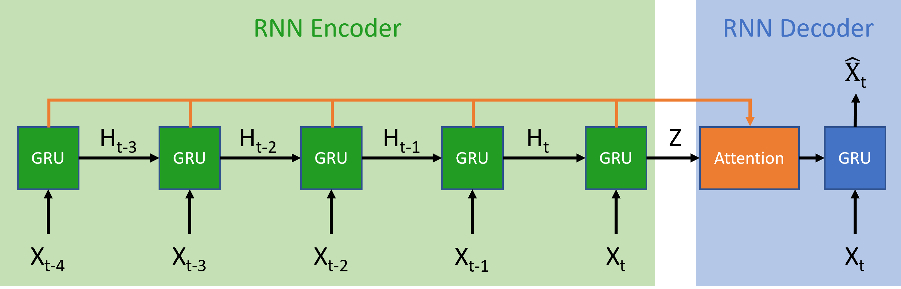

# Learning Thermal Displacement Compensation from Structured Sequence Data


## Introduction

CNC machine tools are designed to achieve high speed and high precision. Many factors affect machining accuracy, with thermal displacement alone accounting for more than 50% of overall errors. Therefore, predicting thermal displacement and using compensation algorithms has become crucial for ensuring the high precision of machine tools. For instance, predicting the cutter's axial displacement at different temperature changes for each casting component. Compared with the traditional random forest classifier, this work employs the RNN-based sequence-to-sequence model combined with the attention mechanism to predict the cutter axis displacement. The conducted experiments show that compared to the traditional random forest classifier, the employed sequence-to-sequence model has a higher accuracy in predicting the cutter axis displacement.


## Implementation
### 1. Prerequisites
* Ubuntu 20.04.6
* Python 3.9
* Pytorch 1.7.1
* CUDA 10.1


### 2. Data Preparation
* Please follow preparedata.py and ./data/data.xlsx to prepare the corresponding data.


### 3. Quick Start
```bash
  $ git clone https://github.com/CAIVIAC/FL_THERMAL.git
  $ conda create --name fl_thermal python=3.7 -y
  $ conda activate ait
  $ pip install torch==1.7.1+cu101 torchvision==0.8.2+cu101 torchaudio==0.7.2 -f https://download.pytorch.org/whl/torch_stable.html
  $ bash ./running_scripts.sh
``` 
 

### 4. Results
_S2S2[e100].png)
_S2S2[e100].png)
_S2S2[e100].png)
_S2S2[e100].png)
_S2S2[e100].png)


## Acknowledgments
Our code is based on [seq2seq](https://github.com/bentrevett/pytorch-seq2seq/tree/master) and [Seq2Seq Time Series Forecasting](https://github.com/maxbrenner-ai/seq2seq-time-series-forecasting-fully-recurrent/tree/main).
